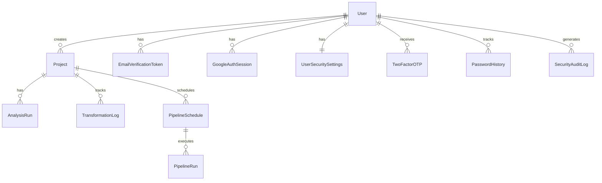

# AnalytiCore Architecture

## Tech Stack

| Component | Technology |
|-----------|------------|
| Backend | Django 5.2 + Django REST Framework |
| Frontend | React 18 + Tailwind CSS + shadcn/ui (Radix) |
| Database | SQLite (dev) / MySQL (prod) |
| Task Queue | Celery + Redis + django-celery-beat |
| ML/Stats | scikit-learn, scipy, pandas, numpy |
| Charts | Recharts (frontend), matplotlib/plotly (backend exports) |
| Auth | Token Auth + Google OAuth + Email 2FA |
| API Docs | drf-yasg (Swagger/ReDoc) |
| Payments | Stripe |

## Backend Architecture

The backend follows Django's **app-per-domain** pattern with 7 apps:

```
backend/
├── analyticore_api/          # Django project settings & root URLs
│   ├── settings.py           # Configuration (env-driven)
│   ├── urls.py               # Root URL routing
│   ├── celery.py             # Celery app configuration
│   └── exception_handler.py  # Custom DRF exception handler
│
├── users/                    # Authentication & user management
│   ├── models.py             # User, EmailVerificationToken, GoogleAuthSession
│   ├── views.py              # Register, login, logout, email verify, Google OAuth
│   ├── serializers.py        # User serializers
│   ├── security_models.py    # 2FA OTP, password history, audit logs
│   ├── security_views.py     # 2FA enable/disable, password change/reset
│   ├── notification_*        # Push/email notification system
│   ├── billing_*             # Stripe subscription management
│   ├── admin_*               # SaaS admin dashboard & analytics
│   └── health_monitoring.py  # System health checks
│
├── projects/                 # Project CRUD & comparison
│   ├── models.py             # Project model (file paths, stats, transformations)
│   ├── views.py              # Create, list, get, delete projects
│   └── compare_views.py      # Side-by-side project comparison
│
├── analysis/                 # Statistical analysis & ML
│   ├── views.py              # Analysis endpoints (stats, correlation, distribution)
│   ├── statistics.py         # StatisticalAnalyzer (descriptive stats, correlation, charts)
│   ├── insights.py           # Rule-based cleaning recommendations & insights
│   ├── ml_service.py         # Regression, classification, clustering, PCA
│   ├── ml_views.py           # ML training, prediction, auto-ML endpoints
│   ├── magic_analysis_service.py  # One-click comprehensive analysis
│   ├── magic_views.py        # Magic analysis endpoints
│   └── services/             # DataLoader, Transformation, ColumnAction services
│
├── data_ingestion/           # File upload & data source connectors
│   ├── models.py             # Upload metadata
│   └── views.py              # CSV/Excel/JSON upload, data preview
│
├── exports/                  # Data & visualization exports
│   ├── views.py              # Basic data export (CSV, Excel)
│   └── enhanced_views.py     # Statistics, correlation, chart image exports
│
├── pipelines/                # Scheduled analysis pipelines
│   ├── models.py             # PipelineSchedule, PipelineRun, PipelineStep
│   ├── views.py              # Schedule CRUD, run history
│   ├── tasks.py              # Celery task execution
│   ├── base.py               # Base pipeline step class
│   ├── context.py            # Pipeline execution context
│   └── steps/                # Individual pipeline step implementations
│
├── api_integrations/         # External data source connectors
│   ├── views.py              # Google Sheets, MySQL, PostgreSQL connectors
│   └── models.py             # DataSource, GoogleSheetsCredentials
│
└── tests/                    # Integration test suite
    ├── test_analyticore.py
    ├── test_analysis_api.py
    ├── test_magic_analysis.py
    └── ... (10 test files)
```

## Frontend Architecture

React 18 SPA bootstrapped with Create React App + CRACO:

```
frontend/src/
├── App.js                    # Router with protected routes
├── api.js                    # Centralized API client (axios)
│
├── pages/                    # 15 page components
│   ├── LandingPage.js        # Public marketing page
│   ├── SignIn.js / SignUp.js  # Authentication
│   ├── Dashboard.js          # Project list & overview
│   ├── ProjectView.js        # Data upload, analysis, ML
│   ├── AdminDashboard.js     # SaaS admin metrics
│   ├── ScheduledPipelines.js # Pipeline management
│   ├── CompareProjects.js    # Project comparison
│   ├── SecuritySettings.js   # 2FA, password management
│   └── NotificationSettings.js
│
├── components/
│   ├── ui/                   # shadcn/ui primitives (Radix-based)
│   ├── analysis/             # Analysis visualization components
│   ├── data/                 # Data table components
│   ├── project/              # Project-specific components
│   └── admin/                # Admin dashboard components
│
└── hooks/                    # Custom React hooks
```

## API URL Structure

| Prefix | App | Purpose |
|--------|-----|---------|
| `/api/auth/` | users | Register, login, logout, verify email |
| `/api/projects/` | projects + data_ingestion | Project CRUD, file upload, data preview |
| `/api/analysis/` | analysis | Statistics, ML, magic analysis |
| `/api/exports/` | exports | Data & chart exports |
| `/api/pipelines/` | pipelines | Scheduled pipeline management |
| `/api/integrations/` | api_integrations | Google Sheets, database connectors |
| `/api/saas-admin/` | users (admin) | Admin dashboard & analytics |
| `/api/billing/` | users (billing) | Stripe subscription management |
| `/api/notifications/` | users (notifications) | Push/email notification management |

## Database (Django ORM)

Primary models and their relationships:



## Security Features

- **Token Authentication** (DRF TokenAuthentication)
- **Email OTP 2FA** with rate limiting (3 attempts, 10-min expiry)
- **Account lockout** after 5 failed login attempts (30-min cooldown)
- **Password history** (prevents reuse of last 5 passwords)
- **Password expiry** (configurable, default 90 days)
- **Security audit log** (all auth events tracked)
- **Custom exception handler** (hides internal errors in production)

## Future Improvements

1. Extract `users/` sub-modules (billing, notifications, security, admin) into separate Django apps
2. Split large service files (`ml_service.py`, `statistics.py`, `magic_analysis_service.py`) into focused modules
3. Add React Context for auth state and React Query for API caching
4. Create Docker configuration (Dockerfile + docker-compose.yml)
5. Add comprehensive unit tests per app alongside existing integration tests
